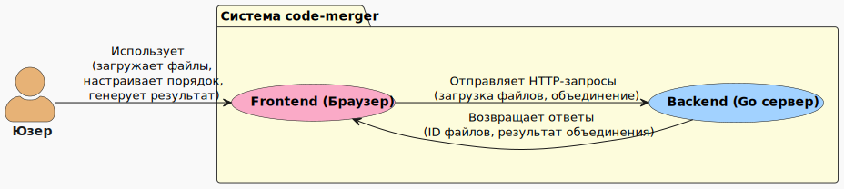
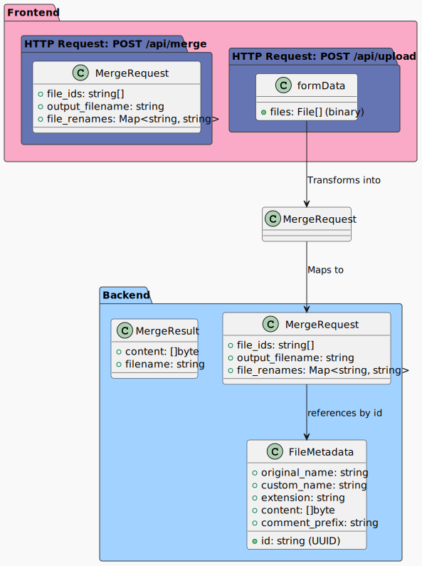
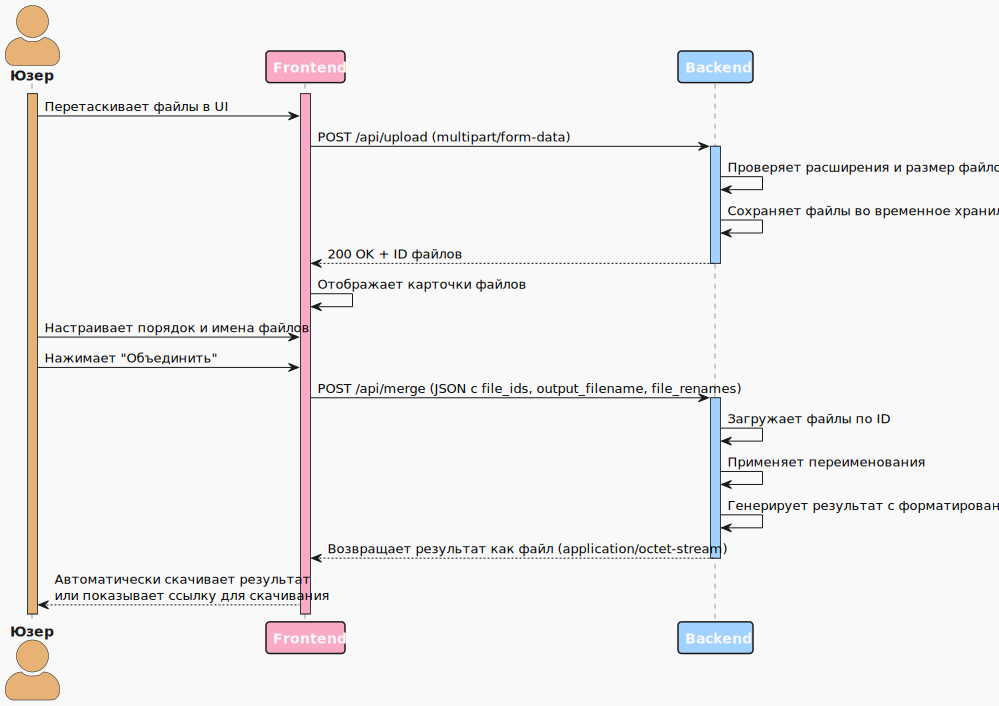

# Software requirements specification // Спецификация требований ПО

## 1. Введение

### 1.1. Назначение

Этот документ определяет функциональные и нефункциональные требования к веб-приложению `code-merger`. Документ предназначен для использования командой разработки и служит основой для проектирования, реализации и тестирования системы.

### 1.2. Область действия

`code-merger` - веб-приложение для объединения содержимого текстовых файлов в один файл с определённым форматированием, предназначенное для подготовки контекста кодовой базы для передачи в нейросетевые модели.

### 1.3. Определения

См. отдельный документ [Глоссарий](../01-business/glossary.md).

### 1.4. Ссылки

1. [Документ концепции и границ](../01-business/vision-and-scope.md)
2. [Глоссарий](../01-business/glossary.md)
3. [API Спецификация](../03-api/api-specification.md)
4. [Диаграммы проекта](../04-diagrams/)

## 2. Общее описание

### 2.1. Перспектива продукта

Диаграмма контекста системы представлена на **Рисунке 1**.
Она показывает систему code-merger в контексте ее взаимодействия с внешней сущностью - Юзером. Frontend и Backend являются частями системы и взаимодействуют между собой через RESTful API.

<i>Рисунок 1. Диаграмма контекста системы code-merger</i>

### 2.2. Функции продукта

- Загрузка файлов через интерфейс Drag-and-Drop.
- Визуальное отображение загруженных файлов в виде карточек.
- Возможность изменения порядка файлов методом перетаскивания.
- Предпросмотр содержимого файлов.
- Переименование файлов для выходного документа.
- Выбор имени результирующего файла из пресетов.
- Объединение файлов с соблюдением правил форматирования.
- Скачивание результата.

### 2.3. Классы юзеров

| Класс юзера | Описание |
| ----------- | -------- |
| **Рядовой юзер** | Основной юзер, использующий приложение для подготовки контекста кода/спецификаций. |

### 2.4. Ограничения

- Поддержка только определённых расширений файлов.
- Максимальный размер загружаемых файлов: 10 МБ на файл, 50 МБ общий.
- Требуется современный браузер с поддержкой `HTML5`.

## 3. Детальные требования

### 3.1. Функциональные требования (FR)

#### 3.1.1. Требования к фронтенду

| ID | Требование | Приоритет |
| -- | ---------- | --------- |
| **FR-001** | Приложение должно предоставлять интерфейс Drag-and-Drop для загрузки файлов | MUST HAVE |
| **FR-002** | Загруженные файлы должны отображаться в виде карточек с иконкой, именем и возможностью предпросмотра | MUST HAVE |
| **FR-003** | Юзер должен иметь возможность изменять порядок файлов методом перетаскивания | MUST HAVE |
| **FR-004** | При наведении на карточку должна появляться иконка "карандаш" для переименования файла | MUST HAVE |
| **FR-005** | При нажатии на иконку "карандаш" должно открываться поле для редактирования имени файла | MUST HAVE |
| **FR-006** | Должна быть возможность сброса кастомного имени к исходному через иконку "крестик" | SHOULD HAVE |
| **FR-007** | Карточка должна содержать кнопку удаления файла из списка | MUST HAVE |
| **FR-008** | Приложение должно предоставлять предпросмотр содержимого файла (до 500 символов) с эффектом размытия при превышении лимита | MUST HAVE |
| **FR-009** | Над кнопкой "Объединить" должно быть текстовое поле для указания имени выходного файла | MUST HAVE |
| **FR-010** | Рядом с текстовым полем должен быть выпадающий список с пресетами: `code-base.txt`, `specifications.txt`, `custom...` | SHOULD HAVE |
| **FR-011** | При выборе пресета из списка текстовое поле должно автоматически заполняться соответствующим значением | SHOULD HAVE |
| **FR-012** | Кнопка "Объединить" должна быть неактивна до загрузки файлов | MUST HAVE |
| **FR-013** | Во время обработки файлов должен отображаться индикатор прогресса, а интерфейс должен блокироваться | MUST HAVE |
| **FR-014** | При невозможности автоматического скачивания должна предоставляться ссылка для скачивания результата | SHOULD HAVE |

#### 3.1.2. Требования к бекенду

| ID | Требование | Приоритет |
| -- | ---------- | --------- |
| **BR-001** | Бекенд должен предоставлять REST API для загрузки и обработки файлов | MUST HAVE |
| **BR-002** | API должен проверять расширения файлов и отклонять неподдерживаемые форматы | MUST HAVE |
| **BR-003** | API должен проверять размер файлов и отклонять превышающие лимит | MUST HAVE |
| **BR-004** | API должен конвертировать кодировку загружаемых файлов в `UTF-8` | MUST HAVE |
| **BR-005** | API должен обрабатывать бинарные файлы с текстовыми расширениями и возвращать ошибку при невозможности конвертации | MUST HAVE |
| **BR-006** | API должен объединять файлы согласно правилам форматирования | MUST HAVE |
| **BR-007** | API должен возвращать результат в виде файла с указанным именем | MUST HAVE |

#### 3.1.3. Правила форматирования

| ID | Требование | Приоритет |
| -- | ---------- | --------- |
| **FORMAT-001** | Каждый файл в результате должен начинаться с заголовка в формате комментария для соответствующего языка | MUST HAVE |
| **FORMAT-002** | После заголовка должна быть пустая строка | MUST HAVE |
| **FORMAT-003** | После пустой строки должно следовать содержимое файла без изменений | MUST HAVE |
| **FORMAT-004** | Файлы в результате должны разделяться тремя пустыми строками | MUST HAVE |

#### 3.1.4. Таблица соответствия расширений файлов и символов комментариев

| Расширение | Символ комментария | Пример заголовка |
| ---------- | ------------------ | ---------------- |
| `.md` | `<!--  -->` | `<!-- api-spec.md -->` |
| `.txt` | `#` | `# notes.txt` |
| `.yaml` | `#` | `# config.yaml` |
| `.yml` | `#` | `# docker-compose.yml` |
| `Dockerfile` | `#` | `# Dockerfile` |
| `.json` | `//` | `// settings.json` |
| `.cpp` | `//` | `// main.cpp` |
| `.go` | `//` | `// main.go` |
| `.py` | `#` | `# main.py` |
| `.html` | `<!--  -->` | `<!-- index.html -->` |
| `.css` | `/*  */` | `/*styles.css*/` |
| `.js` | `//` | `// app.js` |

### 3.2. Нефункциональные требования (NFR)

| ID | Требование | Категория | Приоритет |
| -- | ---------- | --------- | --------- |
| **NFR-001** | Интерфейс должен использовать цветовую палитру: #a2d2ff, #bee2ff, #faaac7, #ffc8dd, #cdb4db, #000000(чёрный), #ffffff(белый) | UI/Дизайн | MUST HAVE |
| **NFR-002** | Приложение должно быть реализовано на `Golang` (бекенд) и `Vanilla JS` (фронтенд) | Технологии | MUST HAVE |
| **NFR-003** | Для стилизации должен использоваться `Tailwind CSS` | Технологии | MUST HAVE |
| **NFR-004** | Для реализации Drag-and-Drop должна использоваться библиотека `Sortable.js` | Технологии | MUST HAVE |
| **NFR-005** | Для анимаций должна использоваться библиотека `Animate.css` | Технологии | SHOULD HAVE |
| **NFR-006** | Приложение должно быть готово к запуску через `Docker Compose` | Развёртывание | MUST HAVE |
| **NFR-007** | Максимальный размер файла: 10 МБ | Производительность | MUST HAVE |
| **NFR-008** | Максимальный общий размер загрузки: 50 МБ | Производительность | MUST HAVE |
| **NFR-009** | API должен поддерживать `CORS` | Безопасность | MUST HAVE |

### 3.3. Требования к интерфейсам

#### 3.3.1. Юзер интерфейсы

Интерфейс должен состоять из:

1. Области Drag-and-Drop для загрузки файлов.
2. Списка карточек загруженных файлов.
3. Поля ввода имени выходного файла с выпадающим списком пресетов.
4. Кнопки "Объединить".

#### 3.3.2. Программные интерфейсы

Бекенд должен предоставлять REST API со следующими endpoint'ами:

- `POST /api/upload` - загрузка файлов.
- `POST /api/merge` - объединение файлов и скачивание результата.

#### 3.3.3. Диаграмма структуры данных (DSD)

Диаграмма структуры данных системы представлена на **Рисунке 2**.
Она показывает:

- Схему запроса к `/api/upload` (многокомпонентная форма с файлами).
- Схему ответа от `/api/upload` (список ID файлов).
- Схему запроса к `/api/merge` (JSON-объект с `file_ids`, `output_filename` и `file_renames`).
- Внутреннюю структуру данных на бекенде, которой он оперирует при обработке.

<i>Рисунок 2. Диаграмма структуры данных системы code-merger</i>

**Пояснение к диаграмме**:

1. **Frontend**:
   - `formData`: Данные, отправляемые при загрузке файлов через `multipart/form-data`.
   - `MergeRequest`: JSON-объект, который фронтенд отправляет на endpoint `/api/merge`. Он содержит:
     - `file_ids` - массив идентификаторов, полученных от бекенда после загрузки.
     - `output_filename` - желаемое имя для итогового файла.
     - `file_renames` - объект, где ключ это оригинальное имя файла, а значение - то, на что его хочет переименовать пользователь (например, `{"main-old.py": "main.py"}`).
2. **Backend**:
   - `FileMetadata`: Внутренняя структура, в которую бекенд преобразует полученные файлы. Он хранит их в памяти (в рамках одного HTTP-запроса) в виде этой структуры. Поле `comment_prefix` вычисляется на основе `extension`.
   - `MergeRequest`: Внутреннее представление запроса на объединение, идентичное тому, что пришло от фронтенда.
   - `MergeResult`: Результат работы алгоритма объединения - готовый бинарный контент для отправки пользователю и имя файла.

#### 3.3.4. Диаграмма последовательности (SD)

Диаграмма последовательности взаимодействия систем представлена на **Рисунке 3**.
Она показывает взаимодействия между Юзером, Frontend и Backend при успешном выполнении операции объединения файлов.

<i>Рисунок 3. Диаграмма структуры данных системы code-merger</i>

## 4. Дополнительные требования

### 4.1. Требования к документации

| ID | Требование | Приоритет |
| -- | ---------- | --------- |
| **DOC-001** | Должна быть предоставлена полная документация API в формате `OpenAPI 3.0` | MUST HAVE |
| **DOC-002** | Должна быть предоставлена ERD-диаграмма в формате `.svg` | MUST HAVE |

### 4.2. Требования к тестированию

| ID | Требование | Приоритет |
| -- | ---------- | --------- |
| **TEST-002** | Должна быть обеспечена проверка обработки ошибок | MUST HAVE |
| **TEST-001** | Должны быть предоставлены тесты для всех основных функций бекенда | SHOULD HAVE |
